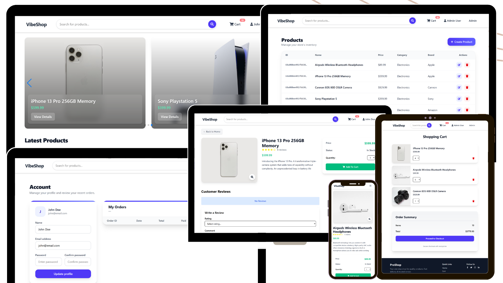

# 🛒 Full-Stack E-Commerce Platform (MERN Stack)

This project is a full-stack eCommerce web application designed to provide a seamless and modern online shopping experience. It combines a feature-rich frontend with a scalable backend API, enabling users to browse products, manage their accounts, place orders, and track shipping with ease. The application follows industry best practices in design, architecture, and usability. From the clean product listing pages to secure authentication flows and an intuitive order management system, every component is carefully crafted to deliver both performance and user-friendliness.

---


## 🌐 Live Demo

[](https://fullstack-mern-ecommerce-app-2i1m.onrender.com/)


## 🚀 Features

- **Authentication & Security**
  - JWT-based authentication
  - Role-based access (User/Admin)
  - Secure password hashing

- **Product Management**
  - Product listing, categories & filtering
  - Product details with reviews & ratings
  - Admin product CRUD operations

- **Cart & Checkout**
  - Add/remove products from cart
  - Shipping & order summary
  - Payment integration (Stripe/PayPal)

- **Orders**
  - Place new orders
  - View order history
  - Admin order management

- **UI/UX**
  - Responsive modern UI (Tailwind + shadcn/ui)
  - Image zoom-in on hover & modal preview
  - Intuitive navigation

---

## 🛠️ Tech Stack

### Frontend
- React + Vite
- TailwindCSS + shadcn/ui
- Axios (API requests)
- React Router DOM

### Backend
- Node.js + Express
- MongoDB + Mongoose
- JWT Authentication
- Bcrypt (Password Hashing)

---

## 📂 Project Structure

```
ecommerce-platform/
│── backend/           # Express + MongoDB server
│   ├── config/        # DB & JWT config
│   ├── controllers/   # Business logic
│   ├── data/          # Sample data
│   ├── middleware/    # middleware
│   ├── models/        # Mongoose models
│   ├── routes/        # API routes
│   ├── utils/         # API utils
│   └── server.js      # App entry point
│
│── frontend/          # React + Vite app
│   ├── public/
│   ├── src/
│   │   ├── components/ # Reusable UI components
│   │   ├── screens/    # Screen pages (Home, Cart, Orders, etc.)
│   │   ├── slices/     # api slices
│   │   ├── utils/      # localstorage utils
│   │   └── main.jsx   
│   └── index.html
│
└── README.md
```

---

## ⚙️ Installation

### 1️⃣ Clone the Repository
```bash
git clone https://github.com/Tapubormon/fullstack-mern-ecommerce-app.git
cd fullstack-mern-ecommerce-app
```

### 2️⃣ Install Dependencies
**Backend**
```bash
cd backend
npm install
```

**Frontend**
```bash
cd frontend
npm install
```

### 3️⃣ Setup Environment Variables & Accounts
#### Required Credentials
- Create a **MongoDB database** and obtain your **MongoDB URI** → [MongoDB Atlas](https://account.mongodb.com/account/login)
- Create a **PayPal account** and obtain your **Client ID** → [PayPal Developer](https://developer.paypal.com/)


Create a `.env` file in **backend/**:

```
NODE_ENV = development
PORT = 5000
MONGO_URI = your mongodb uri
JWT_SECRET = 'your secrect' e.g. "user12546"
PAYPAL_CLIENT_ID = your paypal client id
PAGINATION_LIMIT = 8
```

### 4️⃣ Run the Application
**Run Frontend & Backend**
```bash
cd backend
npm run dev
```

**Backend only**
```bash
cd backend
npm run server
```

**Frontend only**
```bash
cd frontend
npm run dev
```
### 5️⃣ Seed database
You can use the following commands to seed the database with some sample users and products, as well as destroy all data.
```bash
# Import data
npm run data:import

# Destroy data
npm run data:destroy
```

```bash
#Sample User Logins

admin@email.com (Admin)
123456

john@email.com (Customer)
123456

jane@email.com (Customer)
123456
```


---

## 🧑‍💻 Contributing
Contributions are welcome! Please fork this repo & submit a pull request.

